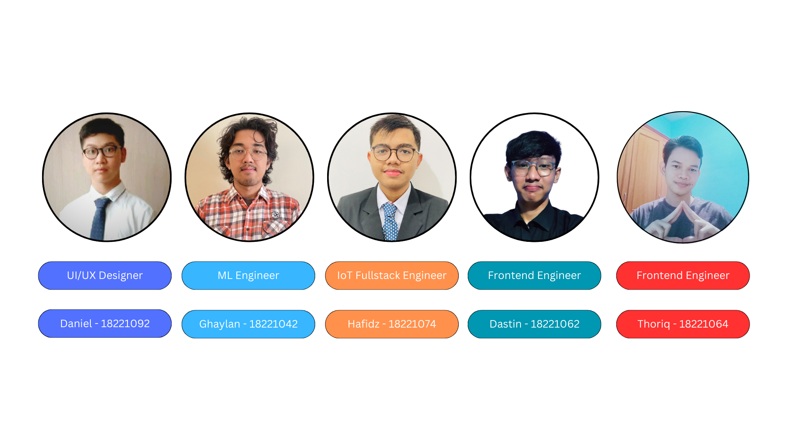
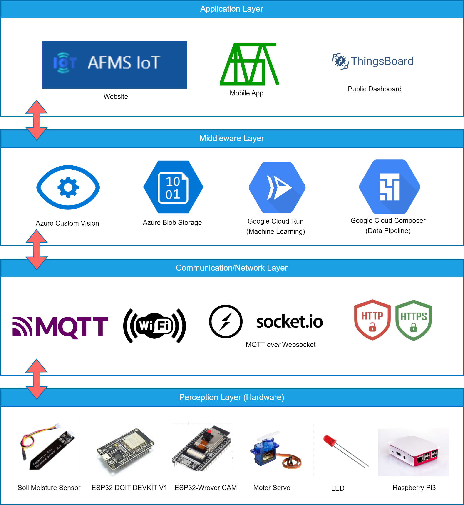
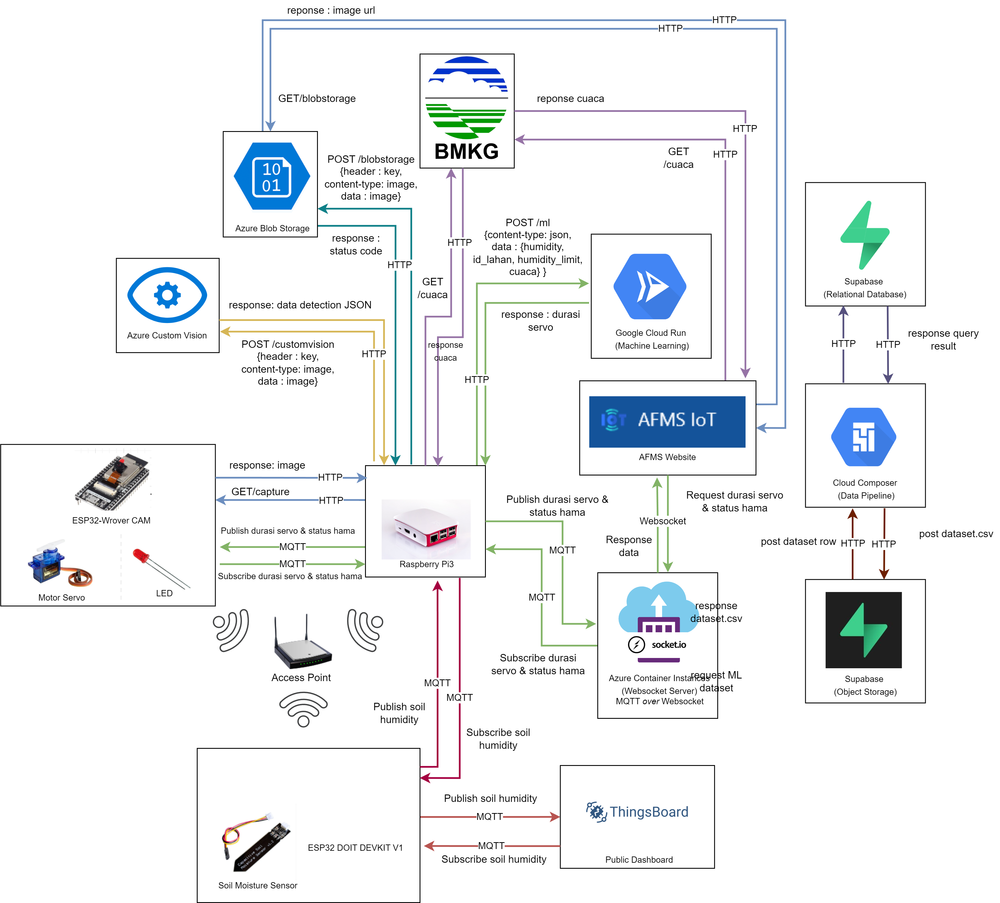
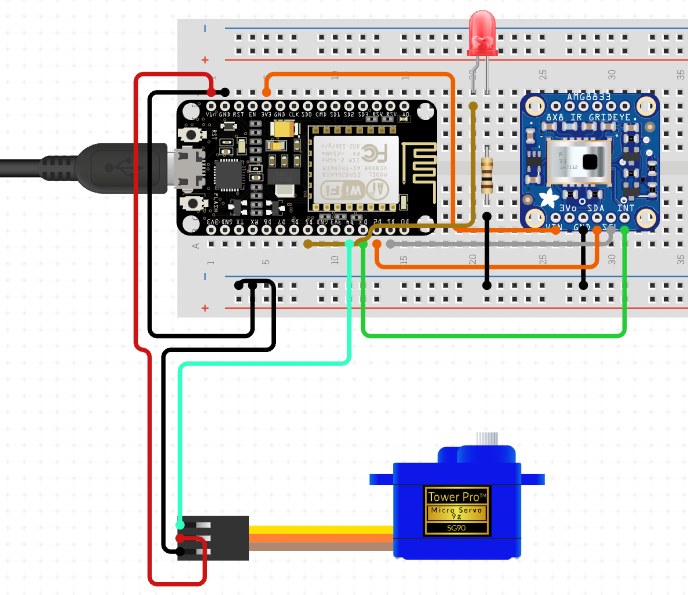
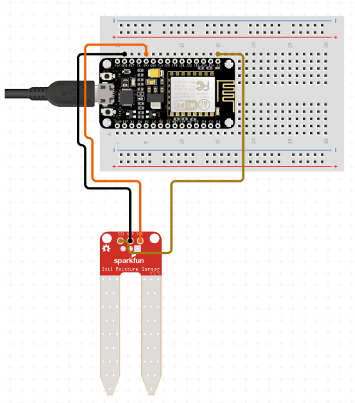
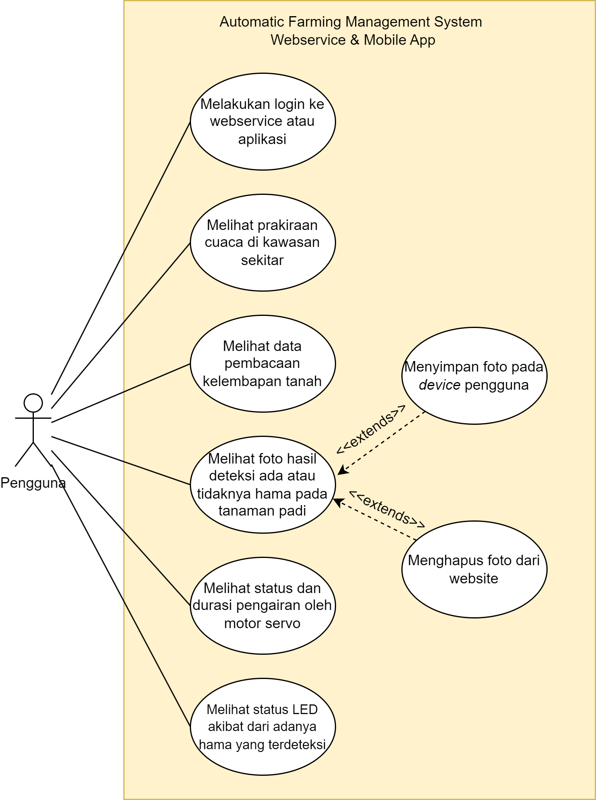

# Automated Farming Management System

Tugas Besar II3240 Rekayasa Sistem dan Teknologi Informasi

Website : 
https://afmsweb.vercel.app/

MAC Address 1 (ESP32 DOIT DEVKIT V1) : 
84:8C:8D:DF:1D:F2

MAC Address 2 (ESP32 WROVER CAM) : 
D8:F3:BC:61:86:E9

## Team

## IoT Architecture Layer

## System Design

## ESP32 Wrover CAM Circuit

## ESP32 DOIT DEVKIT V1 Circuit

## Use Case (Website & Mobile)

